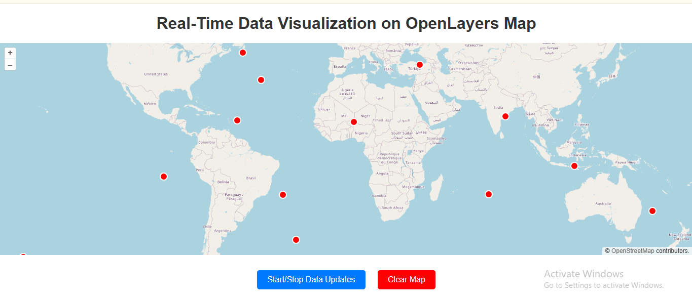

# Real-Time Data Visualization with OpenLayers


This project demonstrates how to use **OpenLayers** to create a dynamic map that displays real-time data. Random points are generated every 2 seconds and plotted on the map, simulating real-time updates. 

## Features
- Displays an interactive OpenStreetMap layer.
- Adds real-time data points dynamically on the map.
- Custom red circular markers for visualization.



## Technologies Used
- **OpenLayers**: A powerful JavaScript library for map rendering.
- **HTML/CSS**: For the structure and styling of the application.
- **JavaScript**: To dynamically add points to the map.

## How to Run
1. Clone the repository:
   ```bash
   git clone https://github.com/praveen-ramasamy/Real-Time-Data-Visualization-with-OpenLayers.git
